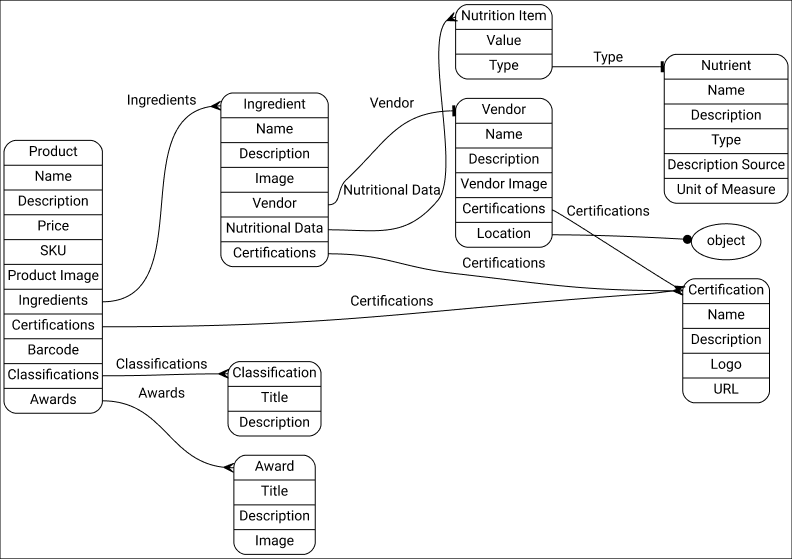
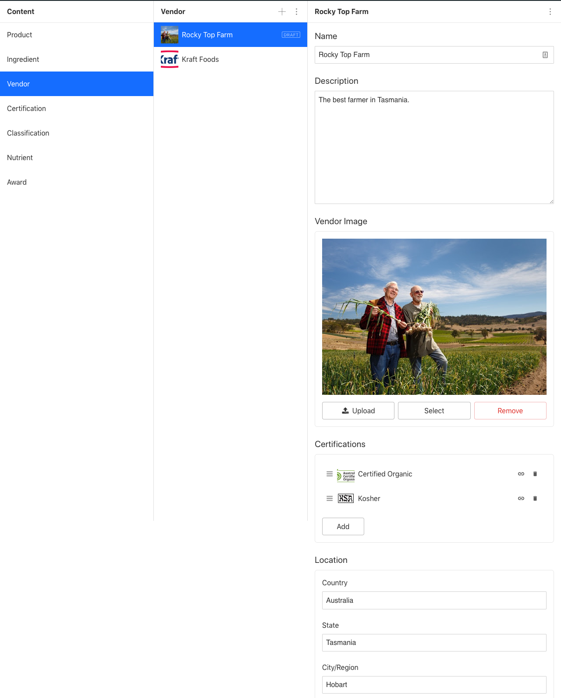

# Sanity Content Model: Food Product Integrity

This is a **theoretical** content model for food products.

It integrates with the [Sanity.io](https://www.sanity.io/) structured content platform.

## Model Context

This premise of the model is: bring greater transparency to food sourcing.

It includes a minimal set of common provisions for products such as `sku` and `price`.

It differentiates from regular product schemas with in the inclusion of product data related to **ingredient sourcing**. A `Vendor` document type relates to every product ingredient so that discerning consumers can learn about the supply-chain realities (where the vendor is situated, what certifications they have) that are linked to the food they consume. This transparency could be leveraged by ethical food producers to tell stories related to their sourcing choices. Fair Trade, B-Corp, Low Food Miles (relative to business owner), etc.

It also includes basic provision for Nutrition Data, Product Certification (Organic, Kosher, etc), Ingredient Certification, Awards, and Dietary Restrictions.

## Applications

### Conceptual

- Promote critical thinking related to content modelling in Sanity,
- or developing content modelling skills in general (see the image graph below)

### Technical

This kind of model could potentially feed:

- Product labels and other printed marketing collateral
- eCommerce Website
- Native App

## Installation

To use this schema as a starter, [create a new Sanity project](https://www.sanity.io/docs/getting-started) and replace the `/schemas` directory with this one.

## Notes

- **This is not a production-ready model**. It lacks essential detail that can only be informed by real-world business needs.
- It doesn't contain provision for rich text or block content. That could be added.
- No customisations have been applied to:
  - Structure Builder
  - Previews
  - Field validation

## Model

## Sanity Desk

